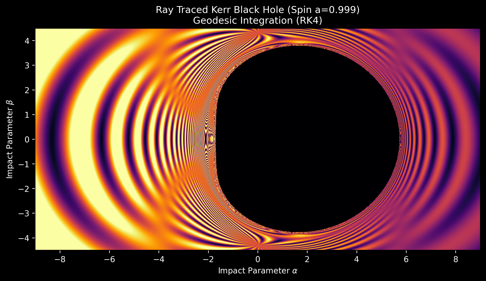

# Ray Traced Kerr Black Hole Shadow



## 🌌 Overview

This repository contains a high-performance **General Relativistic Ray Tracer** written in C++ with an OpenMP parallelization backend. It visualizes the shadow of a rapidly rotating **Kerr Black Hole** (spin parameter $a = 0.999$) by numerically integrating null geodesics (photon paths) in curved spacetime.

The simulation uses **Backward Ray Tracing**: rays are fired from a virtual camera, through a screen, towards the black hole. The code solves the Hamiltonian equations of motion for massless particles to determine if a ray is captured by the Event Horizon or escapes to the celestial sphere.

## 📂 Repository Structure

* **`RTKerrBH.cpp`**: The core C++ simulation engine. Handles the physics, RK4 integration, and parallel ray generation.
* **`RTKerrPlot.py`**: A Python visualization script that parses the raw data output and generates the heat-mapped image using `matplotlib`.
* **`RToutput.dat`**: The raw sparse matrix output containing pixel coordinates, escape status, and intensity values.
* **`BH.png`**: The rendered output image.

---

## ⚛ Physics

### 1. The Kerr Metric
The simulation models spacetime around a rotating uncharged black hole using the **Boyer-Lindquist metric**. The line element $ds^2$ is defined by the spacetime geometry:

$$
ds^2 = -\left(1 - \frac{2Mr}{\Sigma}\right) dt^2 - \frac{4Mar \sin^2\theta}{\Sigma} dt d\phi + \frac{\Sigma}{\Delta} dr^2 + \Sigma d\theta^2 + \left(r^2 + a^2 + \frac{2Ma^2r \sin^2\theta}{\Sigma}\right) \sin^2\theta d\phi^2
$$

Where:
* $M$: Mass of the Black Hole ($M=1.0$ in code).
* $a$: Spin parameter ($a=0.999$, near extremal limit).
* $\Delta = r^2 - 2Mr + a^2$
* $\Sigma = r^2 + a^2 \cos^2\theta$

### 2. Hamiltonian Formalism
Instead of solving the second-order geodesic equations directly, the code utilizes the **Hamiltonian formalism**. For photons (null geodesics), the Hamiltonian $\mathcal{H}$ is zero:

$$
\mathcal{H} = \frac{1}{2} g^{\mu\nu} p_\mu p_\nu = 0
$$

The trajectory of a photon is determined by solving Hamilton's equations, a system of 8 coupled first-order ODEs:

1.  **Velocity:** $\frac{dx^\mu}{d\lambda} = \frac{\partial \mathcal{H}}{\partial p_\mu}$
2.  **Force/Curvature:** $\frac{dp_\mu}{d\lambda} = -\frac{\partial \mathcal{H}}{\partial x^\mu}$

Where $\lambda$ is the affine parameter, $x^\mu$ represents coordinates $(t, r, \theta, \phi)$, and $p_\mu$ represents the four-momentum.

### 3. The Event Horizon
The Event Horizon is located at the larger root of $\Delta = 0$:

$$
R_{horizon} = M + \sqrt{M^2 - a^2}
$$

Any ray that crosses this threshold ($r < R_{horizon}$) is considered "captured" and renders as black.

---

## 💻 Computational Implementation

### 1. Numerical Integration (RK4)
The C++ engine (`RTKerrBH.cpp`) employs the **4th-Order Runge-Kutta (RK4)** method. This provides a high-accuracy solution to the 8 coupled ODEs.
* **Steps:** The integrator samples the curvature at the start, midpoint, and end of a tiny step $d\lambda$ to predict the next position.
* **Adaptive Limits:** The code allows for up to 2,000,000 steps per ray to accurately resolve photon orbits (spherical photon orbits) that circle the black hole multiple times before escaping or falling in.

### 2. Camera & Screen
* **Pinhole Camera Model:** The camera is located at $R_{cam} = 1000M$ in the equatorial plane ($\theta = \pi/2$).
* **Impact Parameters:** The screen coordinates $(\alpha, \beta)$ are mapped to the initial four-momentum of the photon. This effectively simulates what an observer would see looking through a telescope.

### 3. Procedural Sky Rendering
Rays that escape the black hole ($r > 2000M$) hit a "virtual sky." The code procedurally generates the visual pattern seen in the background:
* **Grid Pattern:** Calculated using `sin(30*phi)` and `sin(3*theta)` to visualize the gravitational lensing.
* **Doppler Beaming:** An intensity gradient is applied based on the horizontal impact parameter to simulate relativistic beaming effects often seen in accretion disks.

### 4. Parallelization
The code uses **OpenMP** (`#include <omp.h>`) to parallelize the loop over the image height ($H$).
`#pragma omp parallel for schedule(dynamic)`
This allows the ray tracer to utilize all available CPU cores, significantly reducing render time for the $1200 \times 675$ resolution image.

---

## 🚀 How to Run

### Prerequisites
* **C++ Compiler:** `g++` (GCC) with OpenMP support.
* **Python 3.x:** with `pandas`, `numpy`, and `matplotlib`.

### 1. Compilation
Compile the C++ source code with optimization flags enabled:

```bash
g++ -fopenmp RTKerrBH.cpp -o raytracer
